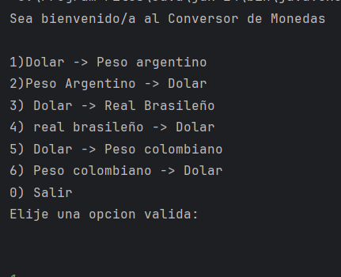
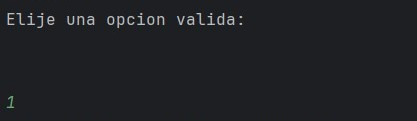
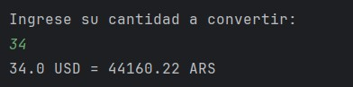
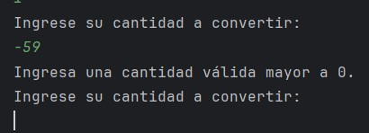
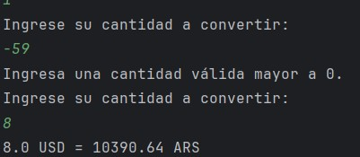
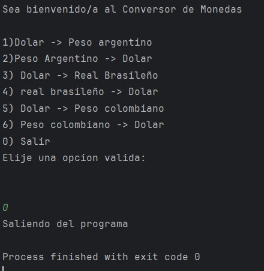

# Challenge Conversor de Monedas

## Objetivo
Este challenge consistió en desarrollar una aplicación en Java que permite convertir cantidades entre diferentes monedas, utilizando tasas de cambio obtenidas en tiempo real desde la API **ExchangeRate-API**. El programa integra conceptos clave de programación como métodos, manejo de excepciones, bucles, condicionales, y la manipulación de datos JSON mediante la biblioteca **Gson**.

## Aprendizaje
Durante el desarrollo del challenge, pude reforzar conocimientos previos en Java y aprender nuevas habilidades, incluyendo:

- Uso de **HttpClient**, **HttpRequest** y **HttpResponse** para interactuar con APIs.
- Manejo y parseo de **JSON** con Gson para extraer tasas de cambio.
- Implementación de métodos modulares para realizar conversiones y validar entradas del usuario.
- Manejo de errores y validaciones de input para asegurar que los datos ingresados sean correctos.
- Diseño de un menú interactivo que permite al usuario elegir entre varias conversiones de moneda.

## Manual
- Al iniciar el programa, se muestra un **menú con opciones de conversión**, donde se pueden elegir pares de monedas (ej. Dólar -> Peso argentino).  
  

- El usuario selecciona la opción deseada ingresando un número correspondiente.  
  

- Se solicita al usuario ingresar la **cantidad a convertir**.  
  

- Si el usuario ingresa un valor no numérico o negativo, se muestra una **alerta indicando que la entrada es inválida**.  
  

- El programa realiza la conversión utilizando la **tasa de cambio obtenida de la API** y muestra el resultado en pantalla.  
  

- El menú se repite hasta que el usuario elija la opción de **salir**.  
  
